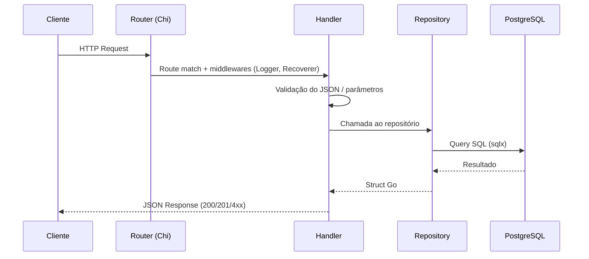
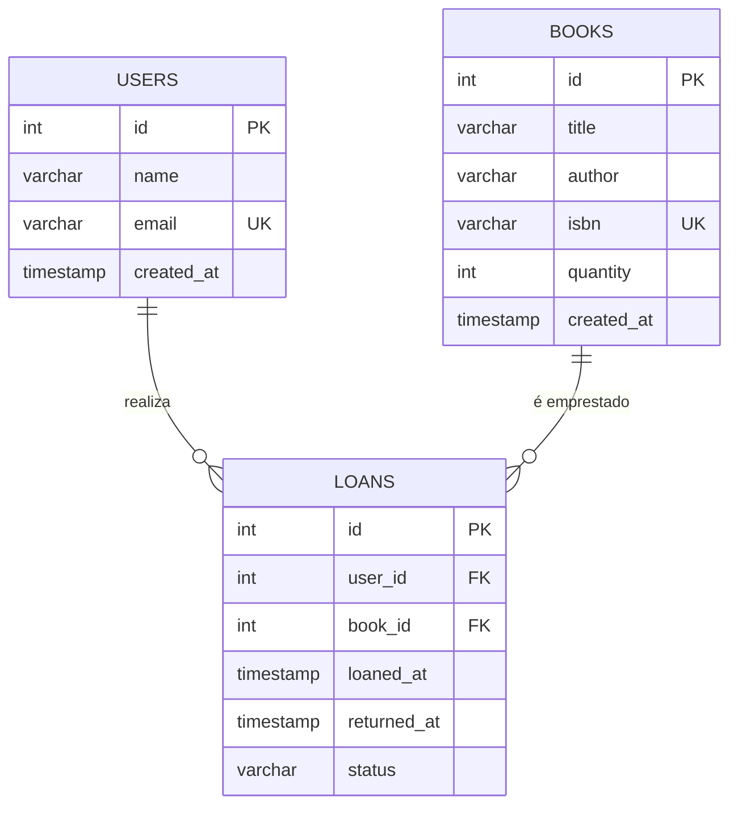
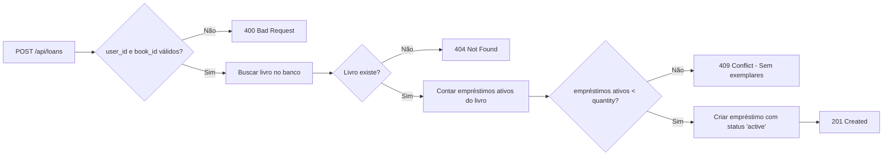

# 📚 Library API

API REST para gerenciamento de uma biblioteca, desenvolvida como Trabalho de Conclusão de Curso (TCC).

A aplicação permite o cadastro de **usuários** e **livros**, a **consulta** do acervo por título ou autor, e o controle de **empréstimos** com validação de disponibilidade de exemplares.

## Stack Tecnológica

| Componente | Tecnologia |
|---|---|
| Linguagem | Go |
| Router HTTP | [Chi](https://github.com/go-chi/chi) |
| Banco de dados | PostgreSQL 16 |
| Driver SQL | [pgx](https://github.com/jackc/pgx) + [sqlx](https://github.com/jmoiron/sqlx) |
| Migrations | SQL puro |
| Container | Docker Compose |

---

## System Design

### Visão Geral da Arquitetura

```
┌─────────────┐       HTTP/JSON        ┌──────────────────────────────────────┐
│             │ ◄────────────────────►  │            API Server (Go)           │
│   Cliente   │   POST/GET/PATCH       │                                      │
│  (Postman,  │                        │  ┌────────┐  ┌──────┐  ┌──────────┐ │
│   curl,     │                        │  │Router  │─►│Handle│─►│Repository│ │
│   Frontend) │                        │  │ (Chi)  │  │ rs   │  │          │ │
│             │                        │  └────────┘  └──────┘  └─────┬────┘ │
└─────────────┘                        │                              │      │
                                       └──────────────────────────────┼──────┘
                                                                      │
                                                                      │ SQL
                                                                      ▼
                                                               ┌─────────────┐
                                                               │ PostgreSQL  │
                                                               │   (Docker)  │
                                                               └─────────────┘
```

### Fluxo de Requisição



### Diagrama Entidade-Relacionamento



### Fluxo de Empréstimo



---

## Endpoints da API

### Usuários

| Método | Rota | Descrição |
|---|---|---|
| `POST` | `/api/users` | Criar usuário |
| `GET` | `/api/users` | Listar todos os usuários |
| `GET` | `/api/users/{id}` | Buscar usuário por ID |

### Livros

| Método | Rota | Descrição |
|---|---|---|
| `POST` | `/api/books` | Cadastrar livro |
| `GET` | `/api/books` | Listar livros (busca com `?q=termo`) |
| `GET` | `/api/books/{id}` | Buscar livro por ID |

### Empréstimos

| Método | Rota | Descrição |
|---|---|---|
| `POST` | `/api/loans` | Registrar empréstimo |
| `PATCH` | `/api/loans/{id}/return` | Devolver livro |
| `GET` | `/api/loans` | Listar empréstimos (filtro com `?user_id=X`) |

---

## Como Rodar

```bash
# 1. Subir o PostgreSQL
docker compose up -d

# 2. Rodar a API (migrations executam automaticamente)
go run ./cmd/server
```

A API estará disponível em `http://localhost:8080/api`

---

## Estrutura do Projeto

```
├── cmd/
│   └── server/
│       └── main.go              # Entrypoint
├── internal/
│   ├── config/
│   │   └── config.go            # Carrega variáveis de ambiente
│   ├── database/
│   │   ├── connection.go        # Conexão com PostgreSQL
│   │   └── migrations.go        # Executa migrations
│   ├── models/
│   │   └── models.go            # Structs: User, Book, Loan
│   ├── handlers/
│   │   ├── user_handler.go      # Handlers de usuário
│   │   ├── book_handler.go      # Handlers de livro
│   │   └── loan_handler.go      # Handlers de empréstimo
│   ├── repository/
│   │   ├── user_repository.go   # CRUD de usuários
│   │   ├── book_repository.go   # CRUD de livros
│   │   └── loan_repository.go   # CRUD de empréstimos
│   └── router/
│       └── router.go            # Define rotas com chi
├── migrations/
│   └── 001_init.sql             # Schema inicial
├── .env                         # Variáveis de ambiente
├── docker-compose.yml           # PostgreSQL
├── go.mod
└── go.sum
```