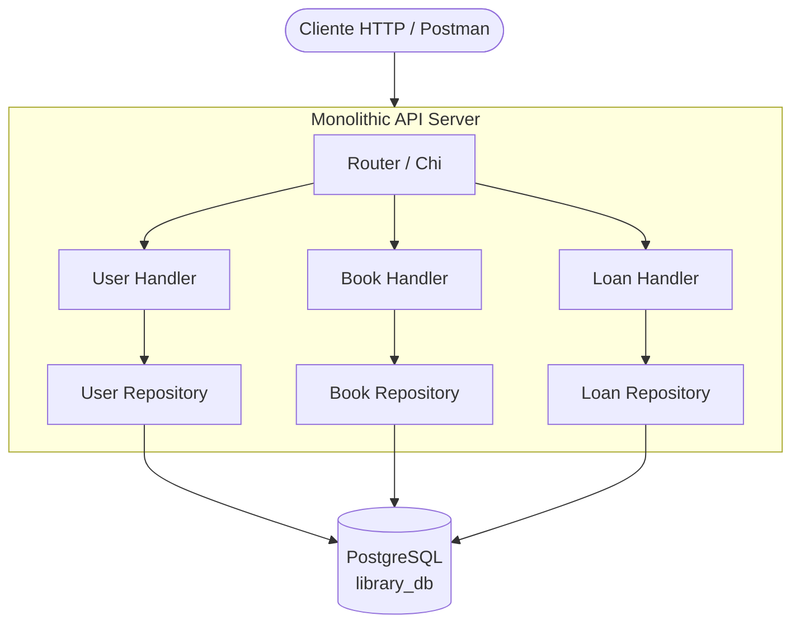
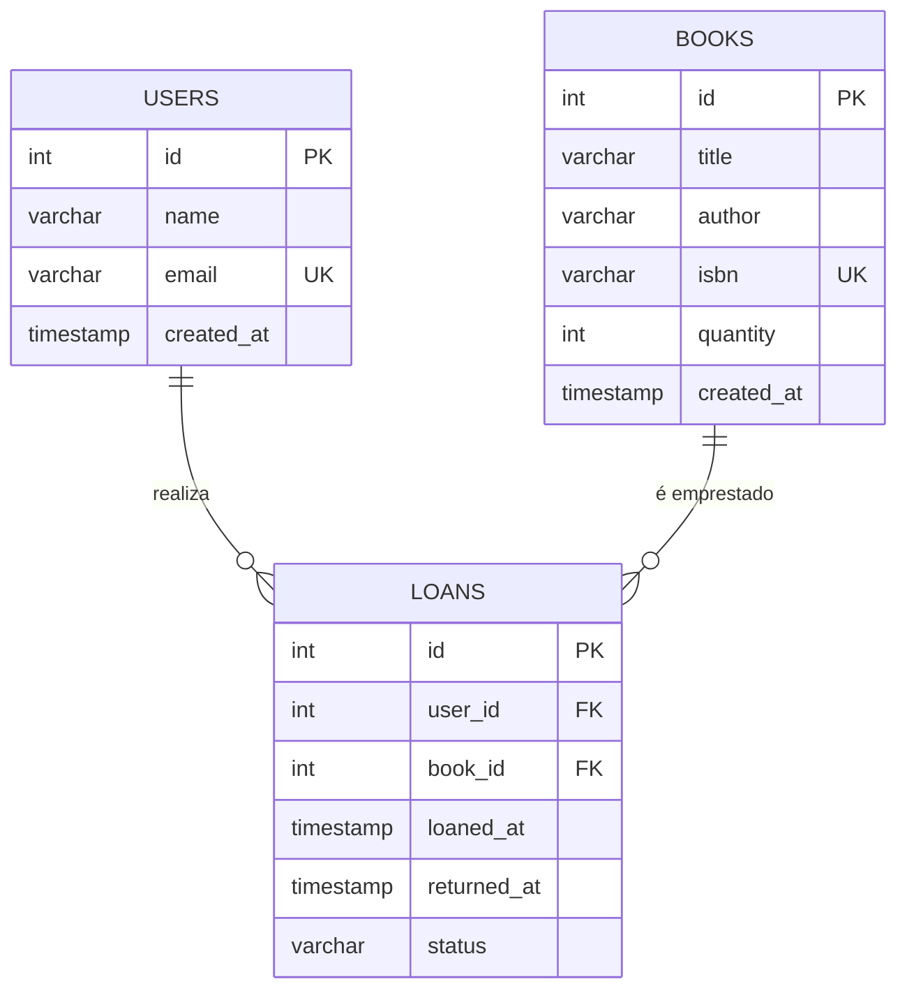

# 📚 Monolith Library API

API REST para gerenciamento de uma biblioteca, desenvolvida como Trabalho de Conclusão de Curso (TCC).
Esta versão implementa a **Arquitetura Monolítica**, onde todos os domínios da aplicação (Usuários, Livros e Empréstimos) residem em um único projeto e compartilham o mesmo banco de dados.

## Stack Tecnológica

| Componente | Tecnologia |
|---|---|
| Linguagem | Go |
| Router HTTP | [Chi](https://github.com/go-chi/chi) |
| Banco de dados | PostgreSQL 16 |
| Driver SQL | [pgx](https://github.com/jackc/pgx) + [sqlx](https://github.com/jmoiron/sqlx) |
| Migrations | SQL puro |
| Container | Docker Compose |

---

## System Design

Na arquitetura monolítica, o cliente faz requisições diretamente para o servidor da API. O servidor possui "Handlers" para cada domínio (User, Book e Loan), que por sua vez se comunicam com seus respectivos Repositórios. Todos os repositórios compartilham a mesma conexão ao banco de dados PostgreSQL.

### Visão Geral da Arquitetura



### Diagrama Entidade-Relacionamento (Banco de Dados Compartilhado)



---

## Endpoints da API

A aplicação expõe as rotas a partir do caminho base `/api`.

### Usuários (`/api/users`)
- `POST /api/users` - Criar usuário.
- `GET /api/users` - Listar todos os usuários.
- `GET /api/users/{id}` - Buscar usuário por ID.

### Livros (`/api/books`)
- `POST /api/books` - Cadastrar livro.
- `GET /api/books` - Listar livros (busca opcional com `?q=termo`).
- `GET /api/books/{id}` - Buscar livro por ID.

### Empréstimos (`/api/loans`)
- `POST /api/loans` - Registrar empréstimo (valida disponibilidade do livro antes de criar).
- `GET /api/loans` - Listar empréstimos (filtro opcional com `?user_id=X`).
- `PATCH /api/loans/{id}/return` - Devolver livro.

---

## Como Rodar

Este diretório contém o `docker-compose.yml` que sobe a infraestrutura do banco de dados para a aplicação.

1. **Subir o banco de dados PostgreSQL:**
```bash
docker compose up -d
```
> O banco de dados estará exposto na porta `5432`.

2. **Rodar o servidor (com as variáveis do `.env`):**
```bash
go run ./cmd/server
```
> As *migrations* (criação de tabelas de usuário, livro e empréstimos) rodarão automaticamente no start da aplicação.

A aplicação vai rodar por padrão na porta **8080**, e a API estará disponível no endereço estruturado padrão `http://localhost:8080/api/`.
